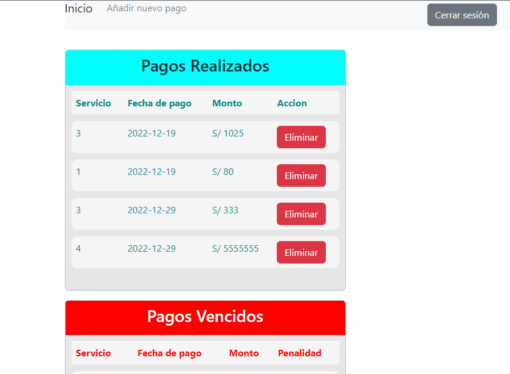
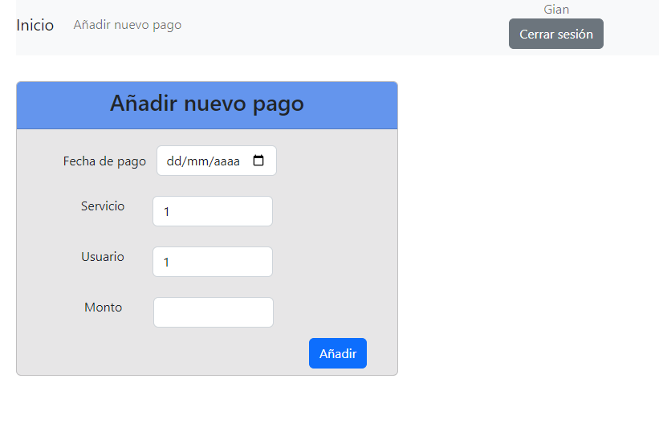
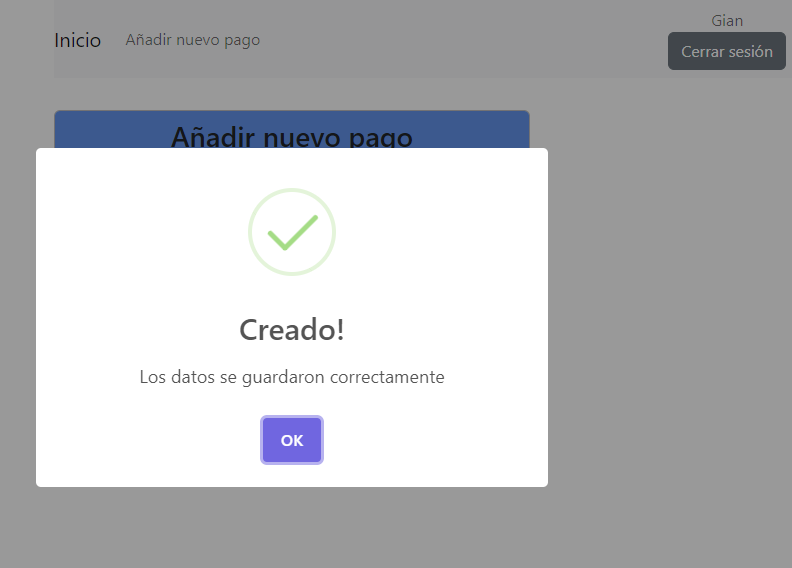

# Unidad5--javascript

<h2>Listado de pagos</h2>

<h2>Creacion de pago</h2>

<h2>Uso de SweetAlert</h2>

## Se uso la api del proyecto 
    https://github.com/starkymc/API-PAGOS-UNIDAD5
    
## Funcionalidad por el momento
    Listado de pagos
    Creacion de pagos
